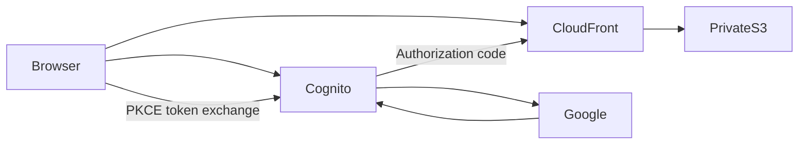
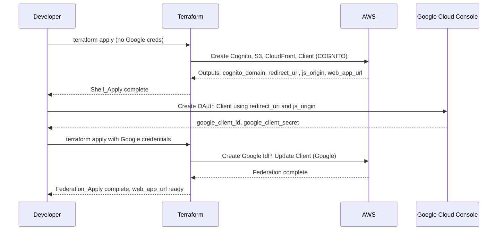

# Design Document

## Overview

This design specifies the Terraform configuration, AWS-hosted demo web app, and README documentation for a Google SSO integration with Amazon Cognito. The solution uses a two-step apply process to break the circular dependency between Cognito's Google IdP redirect URI (needed by Google Console) and Google's OAuth credentials (needed by Cognito).

The architecture remains intentionally small: a Cognito User Pool, managed-login domain, public app client, private S3 + CloudFront demo app, and optionally a Google Identity Provider — all managed via local-state Terraform in an `infra/` directory. An optional Phase 2 adds a pre-sign-up Lambda for email allowlisting.

### Key Design Decisions

1. **Conditional resource creation via `count`** — The Google Identity Provider is gated on both Google credential variables being non-empty, allowing Shell_Apply to succeed without credentials and rejecting partial credential configuration.
2. **Explicit `provider_details`** — All Google OIDC endpoint values are hardcoded in the Terraform resource to prevent the well-known perpetual plan drift issue (hashicorp/terraform-provider-aws#24620).
3. **`random_id` for uniqueness** — A `random_id` resource generates a hex suffix shared by the Cognito domain prefix and S3 bucket name.
4. **Local backend only** — Terraform state stays on disk; no remote backend complexity for a walkthrough project.
5. **Public app client with PKCE** — `generate_secret = false`. The hosted browser app completes authorization-code exchange using PKCE; no client secret is embedded in static assets.
6. **Private S3 + CloudFront OAC** — Static assets are not publicly readable from S3. CloudFront Origin Access Control with `signing_behavior = always` is the only read path.
7. **Current Lambda runtime** — Optional Phase 2 uses `nodejs24.x`. AWS lists its deprecation date as April 30, 2028; recheck before deployment in the [Lambda Node.js runtime documentation](https://docs.aws.amazon.com/lambda/latest/dg/lambda-nodejs.html).
8. **Pre-token trigger event version `V1_0`** — Group overrides work with `V1_0`, which avoids requiring a Cognito Essentials or Plus feature plan.

## Architecture



### Two-Step Apply Sequence



## Components and Interfaces

### File Layout

```text
aws-cognito-google-sso/
├── README.md
├── LICENSE
├── web/
│   ├── index.html
│   ├── styles.css
│   ├── app.js
│   └── app.test.mjs
├── infra/
│   ├── versions.tf
│   ├── providers.tf
│   ├── variables.tf
│   ├── main.tf
│   ├── outputs.tf
│   ├── lambda/
│   │   ├── index.mjs
│   │   └── index.test.mjs
│   ├── terraform.tfvars.example
│   └── .gitignore
└── .kiro/
    └── specs/...
```

### Resource Dependency Graph

| Resource | Depends On | Condition |
| --- | --- | --- |
| `random_id.domain_suffix` | — | Always |
| `aws_cognito_user_pool.main` | — | Always |
| `aws_cognito_user_pool_domain.main` | `user_pool`, `random_id` | Always |
| `aws_s3_bucket.web` | `random_id` | Always |
| `aws_cloudfront_distribution.web` | S3 bucket, OAC | Always |
| `aws_s3_object` assets | bucket, distribution (for config.js) | Always |
| `aws_cognito_identity_provider.google` | `user_pool` | `local.google_federation_enabled` |
| `aws_cognito_user_pool_client.main` | `user_pool`, CloudFront, optionally IdP | Always |
| `data.archive_file.lambda_zip` | Lambda source file | `var.enable_email_allowlist_lambda` |
| `aws_lambda_function.email_allowlist` | `iam_role`, Lambda archive | `var.enable_email_allowlist_lambda` |
| `aws_iam_role.lambda_exec` | — | `var.enable_email_allowlist_lambda` |
| `aws_lambda_permission.cognito` | `lambda`, `user_pool` | `var.enable_email_allowlist_lambda` |

### Component Interfaces

#### variables.tf

| Variable | Type | Default | Sensitive | Description |
| --- | --- | --- | --- | --- |
| `region` | `string` | `"ap-southeast-2"` | No | AWS region for regional resources |
| `google_client_id` | `string` | `""` | No | Google OAuth client ID; empty = Shell_Apply |
| `google_client_secret` | `string` | `""` | Yes | Google OAuth client secret |
| `enable_email_allowlist_lambda` | `bool` | `false` | No | Enable Phase 2 pre-sign-up email allowlist Lambda |
| `allowed_emails` | `list(string)` | `[]` | No | Email addresses permitted by the allowlist Lambda |

#### outputs.tf

| Output | Always Available | Description |
| --- | --- | --- |
| `user_pool_id` | Yes | Cognito User Pool ID |
| `client_id` | Yes | App client ID |
| `cognito_domain` | Yes | Full Cognito managed-login URL |
| `google_redirect_uri` | Yes | `{cognito_domain}/oauth2/idpresponse` |
| `javascript_origin` | Yes | Cognito domain URL without trailing path |
| `web_app_url` | Yes | HTTPS CloudFront URL for the demo app |
| `authorize_url` | Yes | Complete sign-in URL; usable after Federation_Apply |

### Validation Logic

The module sets `required_version = ">= 1.2.0"` because resource preconditions were introduced in Terraform 1.2. Locals calculate the both-or-neither state and the web app URL:

```hcl
locals {
  google_federation_enabled = var.google_client_id != "" && nonsensitive(var.google_client_secret != "")
  google_creds_partial      = (var.google_client_id == "") != nonsensitive(var.google_client_secret == "")
  web_app_url               = "https://${aws_cloudfront_distribution.web.domain_name}"
}
```

A `precondition` on the always-created user pool client rejects partial credentials during planning.

## Data Models

### Cognito User Pool Client (CloudFront callback)

```hcl
resource "aws_cognito_user_pool_client" "main" {
  name         = "google-sso-client"
  user_pool_id = aws_cognito_user_pool.main.id

  generate_secret                      = false
  allowed_oauth_flows_user_pool_client = true
  allowed_oauth_flows                  = ["code"]
  allowed_oauth_scopes                 = ["openid", "email"]

  supported_identity_providers = local.google_federation_enabled ? ["Google"] : ["COGNITO"]

  callback_urls = [local.web_app_url]
  logout_urls   = [local.web_app_url]

  depends_on = [aws_cognito_identity_provider.google]
}
```

### Private S3 + CloudFront hosting

- S3 bucket name: `google-sso-demo-web-${random_id.domain_suffix.hex}`
- `force_destroy = true` so teardown removes the bucket even with uploaded objects
- Block all public access; BucketOwnerEnforced ownership
- CloudFront OAC with `signing_behavior = "always"` and `signing_protocol = "sigv4"`
- Viewer protocol policy: `redirect-to-https`
- Default root object: `index.html`
- Managed cache policy: CachingOptimized
- Response headers: lightweight security headers (frame deny, content-type nosniff, referrer policy)
- Bucket policy allows `s3:GetObject` only from the specific CloudFront distribution ARN
- Uploaded objects: `index.html`, `styles.css`, `app.js`, and generated `config.js`

### Generated `config.js`

Terraform renders a non-secret config object into S3:

```javascript
window.APP_CONFIG = {
  cognitoDomain: "https://....auth....amazoncognito.com",
  clientId: "...",
  redirectUri: "https://dxxxx.cloudfront.net",
  logoutUri: "https://dxxxx.cloudfront.net",
};
```

### Demo web app PKCE flow (`web/app.js`)

1. On Sign in: generate `code_verifier`, `code_challenge` (S256), and `state`; store verifier/state in `sessionStorage`; redirect to Cognito `/oauth2/authorize` with `identity_provider=Google`.
2. On return with `?code=` and matching `state`: POST to Cognito `/oauth2/token` with `grant_type=authorization_code`, `client_id`, `redirect_uri`, `code`, and `code_verifier`.
3. Decode the ID token payload (base64url JSON) and render safe claims (`email`, `name`, `sub`, `cognito:groups` when present). Keep tokens only in memory.
4. On Sign out: clear session storage and redirect to Cognito `/logout` with `client_id` and `logout_uri`.

### Pre-Sign-Up Email Allowlist Lambda (Phase 2)

Optional `nodejs24.x` Lambda attached as Cognito `pre_sign_up`. On
`PreSignUp_ExternalProvider`, it compares the federated email to `allowed_emails`
(case-insensitive list). Allowed emails are auto-confirmed; others throw a
generic authorization error so Cognito does not create the user. Gated by
`enable_email_allowlist_lambda`.

## Error Handling

| Condition | Handling |
| --- | --- |
| Partial Google credentials | Terraform precondition fails the plan |
| Lambda enabled without valid email | Terraform precondition fails the plan |
| OAuth / token exchange failure in browser | Demo app shows a generic error; no secrets or raw tokens rendered |
| Unauthorized email with Phase 2 enabled | Lambda throws; Cognito rejects federated sign-up before user creation |
| CloudFront not yet serving new objects | README documents eventual consistency / short wait after apply |

## State Management

- Local backend means state contains `google_client_secret` in plaintext
- README documents this risk and recommends file permission restrictions
- `.gitignore` excludes state, tfvars, crash logs, and generated Lambda zip archives
- Web assets and `config.js` contain no secrets

## Testing Strategy

| Test Type | What It Validates | Tool |
| --- | --- | --- |
| Terraform validate | HCL syntax | `terraform validate` |
| Terraform mock tests | Shell vs federation plans, hosting resources, callback URLs, Lambda gates | `terraform test` |
| Web app unit tests | PKCE helpers, claim decoding, error handling | `node --test web/app.test.mjs` |
| Lambda unit tests | Allowlist / group override | `node --test lambda/index.test.mjs` |
| End-to-end | Hosted Google sign-in shows claims | Manual after deploy |

### Validation Commands

```bash
cd infra && terraform init && terraform validate && terraform test
node --test ../web/app.test.mjs
node --test lambda/index.test.mjs
```
