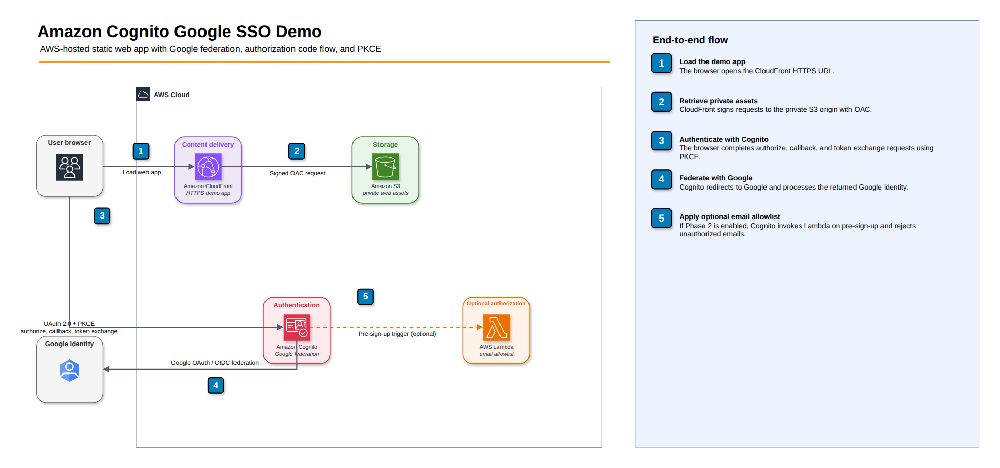
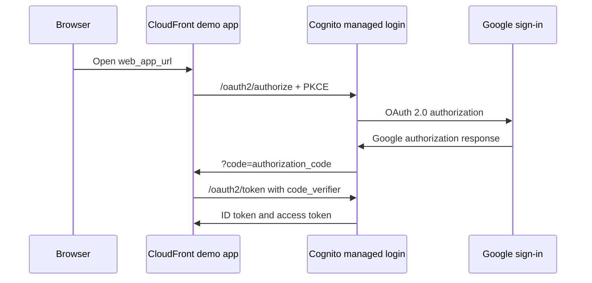

# Amazon Cognito Google SSO with Terraform

This walkthrough deploys Amazon Cognito Google SSO and a basic HTTPS demo web
app on private S3 behind CloudFront. Terraform creates the Cognito resources in
two applies so you can create the Google OAuth client with Cognito's generated
IdP redirect URI between them.

The demo app completes the OAuth 2.0 authorization code flow with PKCE in the
browser, exchanges the code at Cognito, and displays selected ID token claims.
Optional Phase 2 adds a Cognito pre-sign-up Lambda that enforces an email
allowlist before unauthorized federated users are created.

**Repo:** [github.com/jajera/aws-cognito-google-sso](https://github.com/jajera/aws-cognito-google-sso)

## Architecture



Source: [`docs/cognito-google-sso-architecture.drawio`](docs/cognito-google-sso-architecture.drawio)

## Video walkthrough

A short silent-friendly walkthrough with captions is in
[`docs/videos/cognito-google-sso-walkthrough.mp4`](docs/videos/cognito-google-sso-walkthrough.mp4).

Rebuild it (requires `ffmpeg`; optional `docs/videos/music.mp3` for background audio):

```bash
docs/videos/build-walkthrough.sh
```

## Sign-in flow



## Resources

The base configuration creates:

- one Cognito User Pool;
- one Cognito managed-login domain;
- one public User Pool app client;
- one private S3 bucket and CloudFront distribution for the demo app; and
- one Google Identity Provider after Google credentials are supplied.

Optional Phase 2 adds one Lambda function and its IAM resources. The project
does not create a VPC, API Gateway, database, or queue.

## Prerequisites

- Terraform 1.2 or newer
- AWS CLI v2 with credentials authorized to manage Cognito, S3, CloudFront, and,
  for Phase 2, Lambda and IAM resources
- Access to a Google Cloud project where you can configure the OAuth consent
  screen and create OAuth credentials
- Node.js 24 or newer only if you want to run the unit tests

Confirm your AWS identity before applying:

```bash
aws sts get-caller-identity
```

The default region is `ap-southeast-2`. Override `region` in
`terraform.tfvars` if needed. CloudFront remains a global service.

## Step A: Create the Cognito shell and web app

Run the first apply without Google credentials:

```bash
cd infra
terraform init
terraform apply
```

Review the plan and approve it. Terraform creates the User Pool, Cognito domain,
app client, S3 bucket, CloudFront distribution, and uploads the demo app. The
app client temporarily lists `COGNITO` as the supported identity provider.

Read the values needed by Google and the demo app:

```bash
terraform output -raw javascript_origin
terraform output -raw google_redirect_uri
terraform output -raw web_app_url
```

Example shapes:

```text
https://google-sso-demo-<random>.auth.<region>.amazoncognito.com
https://google-sso-demo-<random>.auth.<region>.amazoncognito.com/oauth2/idpresponse
https://dxxxxxxxxxxxxx.cloudfront.net
```

CloudFront can take a few minutes before the site is reachable worldwide. If the
first request fails, wait and retry.

## Step B: Configure Google OAuth

You need a Google Cloud project, a configured OAuth consent screen, and a Web
application OAuth client. The steps below start from nothing. Google Cloud
Console labels change over time, so match on intent if a button has been
renamed.

### B1. Create a Google Cloud project

1. Sign in to the [Google Cloud Console](https://console.cloud.google.com/) with
   the Google account you want to own the project.
2. In the top navigation bar, open the project picker (it shows the current
   project name or "Select a project").
3. Choose **New Project**.
4. Enter a **Project name** (for example, `cognito-google-sso-demo`). Leave the
   organization and location at their defaults if you do not have an
   organization.
5. Choose **Create**, then wait for the notification that the project is ready
   and switch to it using the project picker.

You do not need to enable billing or any additional APIs for a basic OpenID
Connect sign-in that requests only the `openid` and `email` scopes.

### B2. Configure the OAuth consent screen (Google Auth Platform)

1. In the console search bar, go to **Google Auth Platform** (also reachable
   under **APIs & Services > OAuth consent screen**).
2. If prompted, choose **Get started** to begin branding configuration.
3. Under **App information**, enter:
   - **App name**: a label users will see on Google's sign-in screen, such as
     `Cognito Google SSO Demo`.
   - **User support email**: select your own Google email address. This is the
     contact address Google displays to users of the demo.
4. Under **Audience**, choose **External**. This lets any Google account you add
   as a test user sign in while the app stays in Testing mode.
5. Under **Contact information**, add a developer email address.
6. Accept Google's policy acknowledgement if prompted, then choose **Finish**.

Google's current setup wizard may go directly to **Finish** without showing a
separate scopes page. That is expected. You do not need to add scopes manually;
Cognito requests the non-sensitive `openid` and `email` scopes during sign-in.

After finishing, you should see the **OAuth Overview** page with navigation
items including **Branding**, **Audience**, **Clients**, and **Data Access**.

### B3. Add yourself as a test user

While the app is in **Testing** mode, only listed test users can complete
sign-in.

1. In **Google Auth Platform**, open the **Audience** section.
2. Under **Test users**, choose **Add users**.
3. Add the Google email address you will use to test the demo, then save.

### B4. Create the OAuth client

1. From **OAuth Overview**, choose **Create OAuth client**. You can also open
   **Clients** in the left navigation and choose **Create client**.
2. Set **Application type** to **Web application**.
3. Give the client a recognizable **Name**, such as `cognito-demo-web`.
4. Under **Authorized JavaScript origins**, choose **Add URI** and paste the
   Terraform `javascript_origin` output.
5. Under **Authorized redirect URIs**, choose **Add URI** and paste the
   Terraform `google_redirect_uri` output.
6. Choose **Create**.
7. Copy the generated **Client ID** and **Client secret** from the dialog (you
   can reopen the client later to view them again).

Retrieve the two values to paste into Google from Step A:

```bash
terraform output -raw javascript_origin
terraform output -raw google_redirect_uri
```

Run these commands from the `infra/` directory.

Use the exact Terraform output values. Do not add a trailing slash to either
Google value. The `javascript_origin` is the Cognito domain (no path); the
`google_redirect_uri` ends in `/oauth2/idpresponse`. The CloudFront app URL is
the Cognito app-client callback, not a Google Authorized redirect URI.

## Step C: Enable Google federation

Create `infra/terraform.tfvars`:

```hcl
region               = "ap-southeast-2"
google_client_id     = "replace-with-your-client-id.apps.googleusercontent.com"
google_client_secret = "replace-with-your-client-secret"
```

From `infra/`, apply again:

```bash
terraform apply
```

Terraform adds the Google Identity Provider and updates the existing app client
in place to support Google. It does not recreate the User Pool, Cognito domain,
app client, or CloudFront distribution.

Check that the next plan is clean:

```bash
terraform plan -detailed-exitcode
echo $?
```

Exit code `0` means there are no changes. Exit code `2` means Terraform found a
diff, and `1` means the plan failed.

## Test sign-in

Open the hosted demo app:

```bash
terraform output -raw web_app_url
```

1. Choose **Sign in with Google**.
2. Complete Google authentication.
3. Cognito redirects back to the CloudFront app with an authorization code.
4. The app exchanges the code using PKCE and opens a separate protected
   workspace. The sign-in button is no longer shown.
5. The protected workspace welcomes the signed-in user and contains an empty
   application area representing content available only after authentication.
6. Expand **View authentication details** if you want to inspect claims such as
   `email`, `name`, `sub`, and `cognito:groups`.
7. Use **Sign out** in the workspace header to clear the local PKCE session and
   return through Cognito logout.

You can also inspect the generated authorize URL:

```bash
terraform output -raw authorize_url
```

The demo app keeps tokens in memory only. PKCE verifier and state are stored in
`sessionStorage` for the redirect and then cleared.

## Troubleshooting

### `redirect_uri_mismatch` from Google

Copy `terraform output -raw google_redirect_uri` into Google's Authorized
redirect URIs exactly. The required path is `/oauth2/idpresponse`. The
CloudFront URL belongs on the Cognito app client, not in Google's redirect list.

### Wrong JavaScript origin

Use `terraform output -raw javascript_origin`. It is only the scheme and
Cognito domain, with no trailing slash or path.

### Google is not offered as an identity provider

Run Step C with both Google credential variables populated. Supplying only one
is rejected. Then verify:

```bash
terraform plan
```

The app client must have `Google` in `supported_identity_providers`.

### Google consent screen blocks the user

For a consent screen in Testing mode, add the signing-in Google account as a
test user. Also confirm the requested `openid` and `email` scopes are configured
on the consent screen.

### Terraform repeatedly changes `provider_details`

This configuration explicitly sets Cognito's Google endpoint defaults to avoid
provider drift. If a plan still shows changes, compare the values returned by
AWS with Google's current
[OpenID configuration](https://accounts.google.com/.well-known/openid-configuration)
and review the AWS provider release notes before changing them.

### CloudFront returns an error after apply

New distributions and object uploads can take a few minutes to become available.
Confirm the object keys exist in the S3 bucket and retry the CloudFront URL.

### Demo app shows a generic sign-in error

The app intentionally avoids printing tokens or provider error details. Common
causes are an incomplete Federation_Apply, a mismatched Cognito callback URL, or
an expired authorization code. Sign in again from the app home page.

## Optional Phase 2: email allowlist Lambda

Google consumer accounts can complete OAuth for basic identity scopes even when
your Google Cloud app is in Testing mode. Phase 2 therefore enforces the
allowlist in Cognito with a pre-sign-up Lambda on `nodejs24.x`.

On first Google federation (`PreSignUp_ExternalProvider`), Cognito invokes the
Lambda. It compares the federated email case-insensitively to `allowed_emails`.
A match is auto-confirmed into the user pool. Any other email is rejected before
Cognito creates the user, so unauthorized accounts do not appear under Users.

Add these values to `terraform.tfvars`:

```hcl
enable_email_allowlist_lambda = true
allowed_emails = [
  "operator@gmail.com",
  "admin@gmail.com",
]
```

Then apply:

```bash
terraform apply
```

If someone already signed in before Phase 2, delete that Cognito user first so
the next attempt hits pre-sign-up again.

Run the unit tests without installing dependencies:

```bash
node --test ../web/app.test.mjs
node --test lambda/index.test.mjs
```

Disable Phase 2 by setting `enable_email_allowlist_lambda = false` and applying
again. Terraform then removes its Lambda and IAM resources and detaches the
trigger.

## State and secret safety

`google_client_secret` is marked sensitive, which redacts it from normal
Terraform CLI output. Terraform still stores it in plaintext inside local state
and plan files.

- Never commit `terraform.tfvars`, state files, saved plans, or generated zip
  archives.
- The uploaded `config.js` contains only public Cognito client settings. It does
  not contain the Google client secret.
- Restrict access to the project and state file, for example:

  ```bash
  chmod 600 terraform.tfstate terraform.tfvars
  ```

- For shared or production infrastructure, use a secured remote backend with
  encryption, access controls, locking, and audit logging instead of this
  walkthrough's local state.

## Cost

This project intentionally uses a small set of managed resources, but it does
not promise zero cost. Pricing and free-tier terms can change. Review current
[Amazon Cognito pricing](https://aws.amazon.com/cognito/pricing/),
[Amazon S3 pricing](https://aws.amazon.com/s3/pricing/),
[Amazon CloudFront pricing](https://aws.amazon.com/cloudfront/pricing/),
[AWS Lambda pricing](https://aws.amazon.com/lambda/pricing/), and Google Cloud
OAuth terms before deployment.

## Teardown

From `infra/`:

```bash
terraform destroy
```

Review and approve the destroy plan. Confirm that Terraform reports all
managed resources destroyed, then check:

```bash
terraform state list
```

The command should print no resources. The S3 bucket is configured with
`force_destroy = true` so object cleanup does not block teardown.
